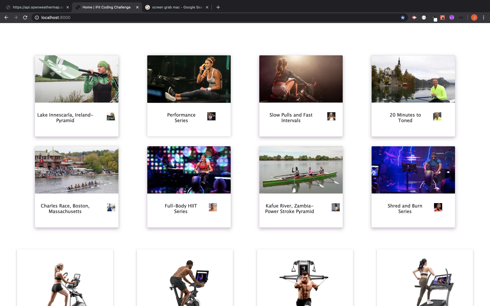
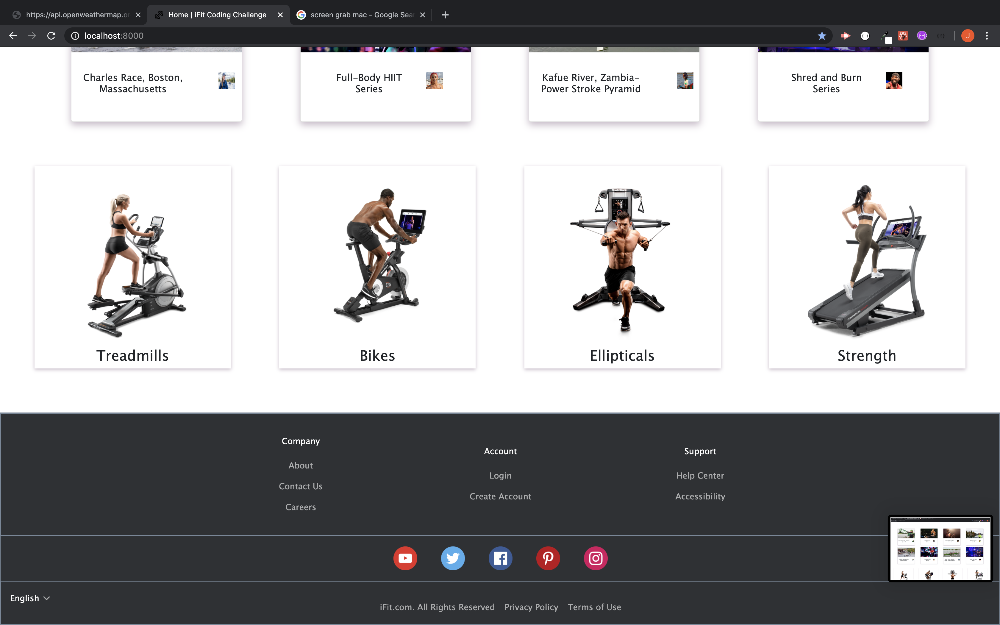

# iFit Coding Challenge

<<<<<<< HEAD
This is a project that was built to try and meet the specs giving by a potential employer. I was given 48 hours to produce a page that resembled an Adobe XD design given to me to the best of my ability.

=======
This is a single page site for iFit. I was given 48hrs to complete based on an Adobe mockup.
>>>>>>> 460efeafe2d55a65af401fdd4cfa5137fdbd8a35

### Tech used

* GitHub
* Visual Studio Code
* Bootstrap
* Node
* Gatsby
* React

## Images of site

Top of page

Middle of page

Bottom of page

## Authors

- **Josh Eskew** 

## Acknowledgments

- Thank you to the iFit team for giving me the opportunity to give this coding challenge a go.
  I really enjoyed the experience!
